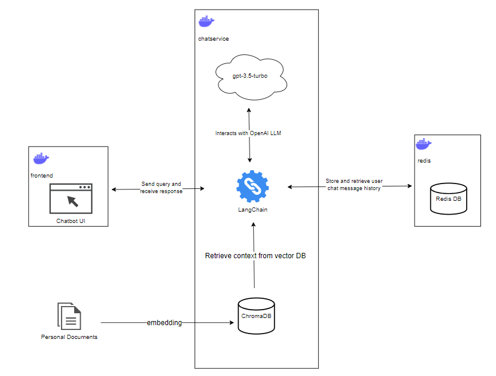

# Self-Intro-LLM-App

## Setup

1. Place your personal PDF documents into folder `personal_docs` and run the provided `create_vector_db.py` script. The script would create a persistent vector database which would be output to `./chatservice/chroma_db`.

2. Rename the `.env.example` to `.env` and set your OpenAI API Key.

3. Install Docker on your system and then run the following command:

```cli
docker-compose up
```

This command starts and runs all the services that defined on `docker-compose.yml`. It downloads all the necessary Docker images, create associated containers and gets them running together.

## Services

The application is a multi-container application which consists of the following services:

1. `frontend`': A Web UI application that provides the user conversational AI interaction, which is built by `chainlit` framework.

2. `redis`: A redis database service that is used for storing chat message history.

3. `chatservice`: A Python (FastAPI) based backend that manages communication between the `frontend` and `redis` service. It manages the interaction history between the user and chatbot. This service also communicates with the OpenAI `gpt-3.5-turbo` model to process user queries and generated the suitable responses based on the provided relevant context from the vector database.

## Architecture



## Future Works
- [ ] Add job queue (rabbitmq. kafka) to process chat requests sent by multiple chat users.
