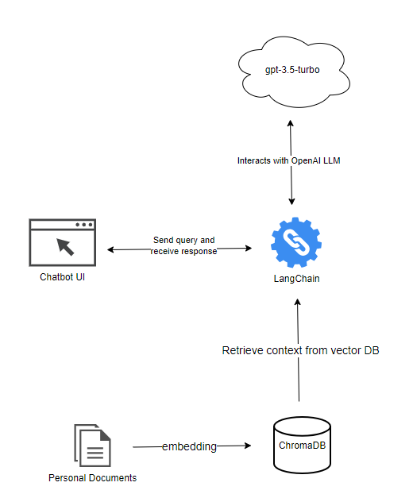

# Self-Intro-LLM-App

## Setup

1. Rename the `.env.example` to `.env` and set your OpenAI API Key.

2. Install python packages:

```cmd
pip install -r requirements.txt

```

3. Then, run the following command to start application:

```cmd
chainlit run app.py --port 7860
```

Now you can interact with the application at <http://localhost:7860>.

## UI


## Architecture



## Future Works

- [ ] Currently, the application is monolith and not scalable to support multiple users. There's a [branch](https://github.com/IvanLauLinTiong/self-intro-llm-app/tree/microservice-design) in development to introduce microservice pattern into this application.
- [ ] Improve prompt template to better exhibit persona
- [ ] Consider to use local LLM to replace the on-cloud OpenAI service so that personal data is not leaving from local device.